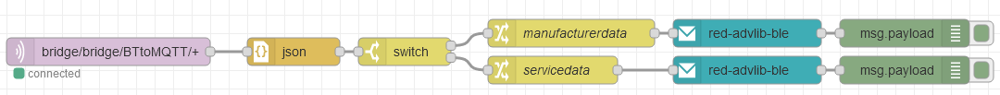

# node-red-contrib-advlib-ble

Node-RED package for decoding BLE advertisement payloads to readable JSON objects.

Decode BLE advertisement payloads to readable JSON objects. Uses
[advlib-ble](https://github.com/reelyactive/advlib-ble).

## Example Usage

Input payload should have a `data` key with the Bluetooth advertisement to be decoded. Output corresponds to the initial object plus a new `advDecoded` field with the decoded result as JSON.
